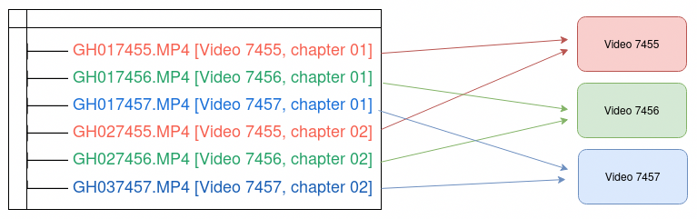

# GoPro Chaptered Video Assembler

**GoPro breaks long videos into multiple files. This utility stitches them back together.**

## Quickstart

```bash
# Install from cargo
$ cargo install gopro-chaptered-video-assembler

# Run the tool
$ gopro-chaptered-video-assembler --input PATH_TO_DIRECTORY_WITH_GOPRO_FILES --output PATH_TO_OUTPUT_DIRECTORY
```

## Why does this exist?

I shoot a lot of long-form videos on my GoPro. Any video longer than a few minutes gets split into multiple files. These are unpleasant to deal with when it's time to edit -- it's tedious and time-consuming to reassemble them. Here's an example of the output structure for multiple long videos:



Figuring out _which video goes where_ did not spark joy. So, this tool does it for me.

It is:

- Easy to use
- Lossless (thanks to [`mp4-merge`](https://github.com/gyroflow/mp4-merge))
- Built with user safety in mind (will never delete your data without asking)
- And has an integration test that uses real GoPro videos

### Why can't you sort the files by creation time in the video editor?

- Not all video editors conveniently support this workflow. [Here's how you do this in Premiere Pro](https://www.youtube.com/watch?v=J-qcGNaneMc). It's not exactly a one-click operation.
- When I recorded the footage, the chaptered video files were one continuous clip. So I should be working with them as one file.

## How does it work?

When you record long-form videos on a GoPro, the videos get split into `~4GB` chunks. In the [file naming conventions spec](https://community.gopro.com/s/article/GoPro-Camera-File-Naming-Convention?language=en_US), GoPro refers to these as chaptered video files.

The naming scheme is:

```bash
GXYYZZZZ.mp4, where:
 X       is the encoding type (X for HEVC, H for AVC .... yes... I know)
  YY     is the chapter number
    ZZZZ is the video number
```

Here is an example directory structure for a single GoPro video (about ~10min long) that was split into three chapters.

```bash
gopro-chaptered-video-example/
├── GX010119.MP4 [Video 0119, chapter 01]
├── GX020119.MP4 [Video 0119, chapter 02]
└── GX030119.MP4 [Video 0119, chapter 03]
```

And here's that example with multiple chaptered videos.


You can see how this gets complicated quickly.

### This tool gives you one single output directory with your GoPro footage

All output files will have the form: `GoPro_{video_number}.MP4`.

#### For Multichapter Videos...

It finds and combines multi-chapter videos using [`mp4-merge`](https://github.com/gyroflow/mp4-merge). If a multi-chapter merge operation is done, a set of commands will be printed at the end to clean up the original source directory. These commands are destructive, and therefore need to be run manually.

#### For Single Chapter Videos...

It renames, or copies (if you use `--no-single-chapter-rename`), single chapter videos.

## Installation

This package is available on [`crates.io`](https://crates.io/crates/gopro-chaptered-video-assembler).

```bash
$ cargo install gopro-chaptered-video-assembler
```

### Building and Installing Source

```
$ git clone https://github.com/alichtman/gopro-chaptered-video-assembler
$ cd gopro-chaptered-video-assembler

# Compile
$ cargo build

# Run dev build
$ cargo run -- [ARGUMENTS]

# Install to machine
$ cargo install --path .
```

Debugging in VSCode works well.

## Example Usage

```bash
$ gopro-chaptered-video-assembler --input "/media/alichtman/Extreme SSD/Rock-Climbing/Gunks/High Exposure/" --output output
╔═══════════════════════════════════════╗
║ gopro-chaptered-video-assembler 0.5.1 ║
╚═══════════════════════════════════════╝
01:49:33 [INFO] Found 39 files in directory: /media/alichtman/Extreme SSD/Rock-Climbing/Gunks/High Exposure
01:49:33 [INFO] Found 5 video(s) with 11 total chapters to combine
01:49:33 [INFO] {
    7515: [
        GoProChapteredVideoFile {
            abs_path: "/media/alichtman/Extreme SSD/Rock-Climbing/Gunks/High Exposure/GH017515.MP4",
            video_number: 7515,
            chapter: 1,
        },
        GoProChapteredVideoFile {
            abs_path: "/media/alichtman/Extreme SSD/Rock-Climbing/Gunks/High Exposure/GH027515.MP4",
            video_number: 7515,
            chapter: 2,
        },
    ],
    7517: [
        GoProChapteredVideoFile {
            abs_path: "/media/alichtman/Extreme SSD/Rock-Climbing/Gunks/High Exposure/GH017517.MP4",
            video_number: 7517,
            chapter: 1,
        },
        GoProChapteredVideoFile {
            abs_path: "/media/alichtman/Extreme SSD/Rock-Climbing/Gunks/High Exposure/GH027517.MP4",
            video_number: 7517,
            chapter: 2,
        },
    ],
    7511: [
        GoProChapteredVideoFile {
            abs_path: "/media/alichtman/Extreme SSD/Rock-Climbing/Gunks/High Exposure/GH017511.MP4",
            video_number: 7511,
            chapter: 1,
        },
        GoProChapteredVideoFile {
            abs_path: "/media/alichtman/Extreme SSD/Rock-Climbing/Gunks/High Exposure/GH027511.MP4",
            video_number: 7511,
            chapter: 2,
        },
        GoProChapteredVideoFile {
            abs_path: "/media/alichtman/Extreme SSD/Rock-Climbing/Gunks/High Exposure/GH037511.MP4",
            video_number: 7511,
            chapter: 3,
        },
    ],
    7477: [
        GoProChapteredVideoFile {
            abs_path: "/media/alichtman/Extreme SSD/Rock-Climbing/Gunks/High Exposure/GH017477.MP4",
            video_number: 7477,
            chapter: 1,
        },
        GoProChapteredVideoFile {
            abs_path: "/media/alichtman/Extreme SSD/Rock-Climbing/Gunks/High Exposure/GH027477.MP4",
            video_number: 7477,
            chapter: 2,
        },
    ],
    7485: [
        GoProChapteredVideoFile {
            abs_path: "/media/alichtman/Extreme SSD/Rock-Climbing/Gunks/High Exposure/GH017485.MP4",
            video_number: 7485,
            chapter: 1,
        },
        GoProChapteredVideoFile {
            abs_path: "/media/alichtman/Extreme SSD/Rock-Climbing/Gunks/High Exposure/GH027485.MP4",
            video_number: 7485,
            chapter: 2,
        },
    ],
}
01:49:33 [INFO] And 27 single chapter video(s) to rename
Proceed? (y/n)
...
```

The `output` directory will be created (in the current directory if a relative path is given, or at an absolute path otherwise), and all output files will be found there.

Additionally, paths with apostrophes (and other special characters) are supported:

```bash
$ gopro-chaptered-video-assembler -i "tests/working_test_data/Test\'s Apostrophe"  -o tests/output
...
```

## Which GoPro models are supported?

Any GoPro model that uses the GoPro file format linked above should be supported. This includes:

- HERO11 Black / Black Mini
- HERO10 Black
- HERO9 Black
- HERO8 Black
- HERO7 White / Silver / Black
- HERO6 Black
